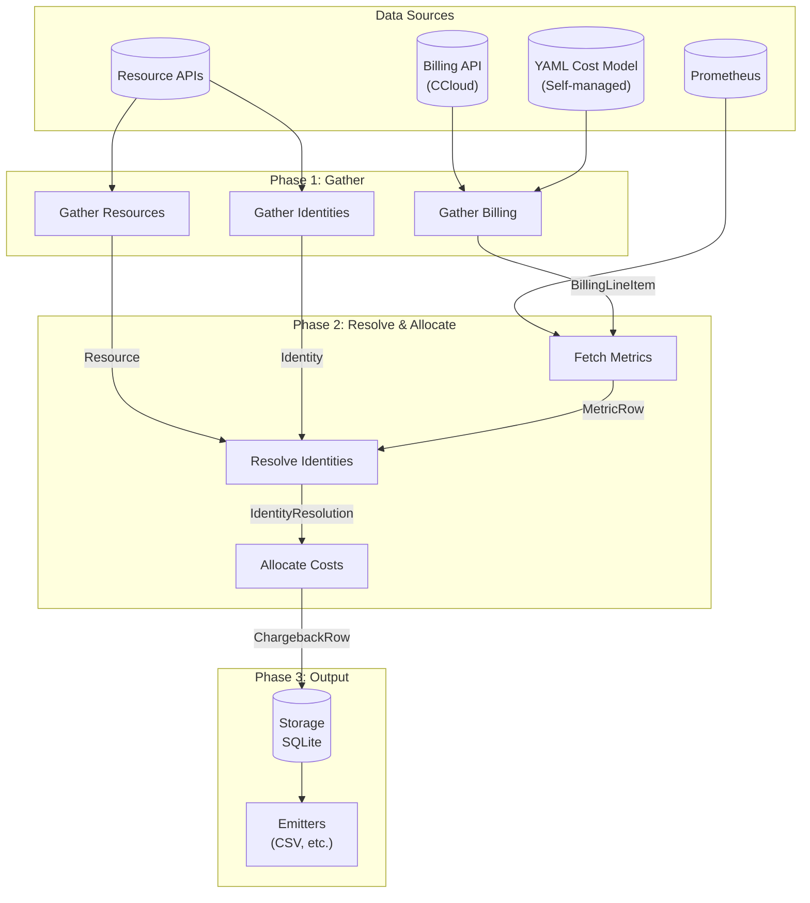

# Data Flow

## Pipeline overview

## Pipeline steps per date

1. **Gather billing** — `CostInput.gather(tenant_id, start, end, uow)`
   Returns `BillingLineItem` objects. CCloud fetches from billing API. Self-managed/generic
   constructs from YAML cost model + Prometheus.

2. **Gather resources** — `handler.gather_resources(tenant_id, uow)`
   Discovers infrastructure resources (clusters, topics, connectors, etc.).
   Stored in `resources` table.

3. **Gather identities** — `handler.gather_identities(tenant_id, uow)`
   Discovers principals, service accounts, teams.
   Stored in `identities` table.

4. **Fetch metrics** — `metrics_source.query_range(...)` per handler
   Prometheus range queries for the billing period. Returns `MetricRow` objects.

5. **Resolve identities** — `handler.resolve_identities(tenant_id, resource_id, ...)`
   Maps billing line items to identities using metrics data.
   Returns `IdentityResolution` (list of `(identity_id, weight)` pairs).

6. **Allocate** — `allocator(AllocationContext) → AllocationResult`
   Splits cost across identities using configured strategy.
   UNALLOCATED identity used for unresolved costs.

7. **Commit** — `ChargebackRow` records written to storage.

8. **Emit** — emitters called with committed rows (aggregated per spec).

## Storage schema

Tables: `billing_line_items`, `resources`, `identities`, `chargeback_rows`, `pipeline_runs`.

Each row is scoped to `(ecosystem, tenant_id)`. No cross-tenant data access.

## Concurrency

Multiple tenants run concurrently (bounded by `features.max_parallel_tenants`).
One orchestrator per tenant. Thread-safe via per-tenant `TenantRuntime` isolation.
