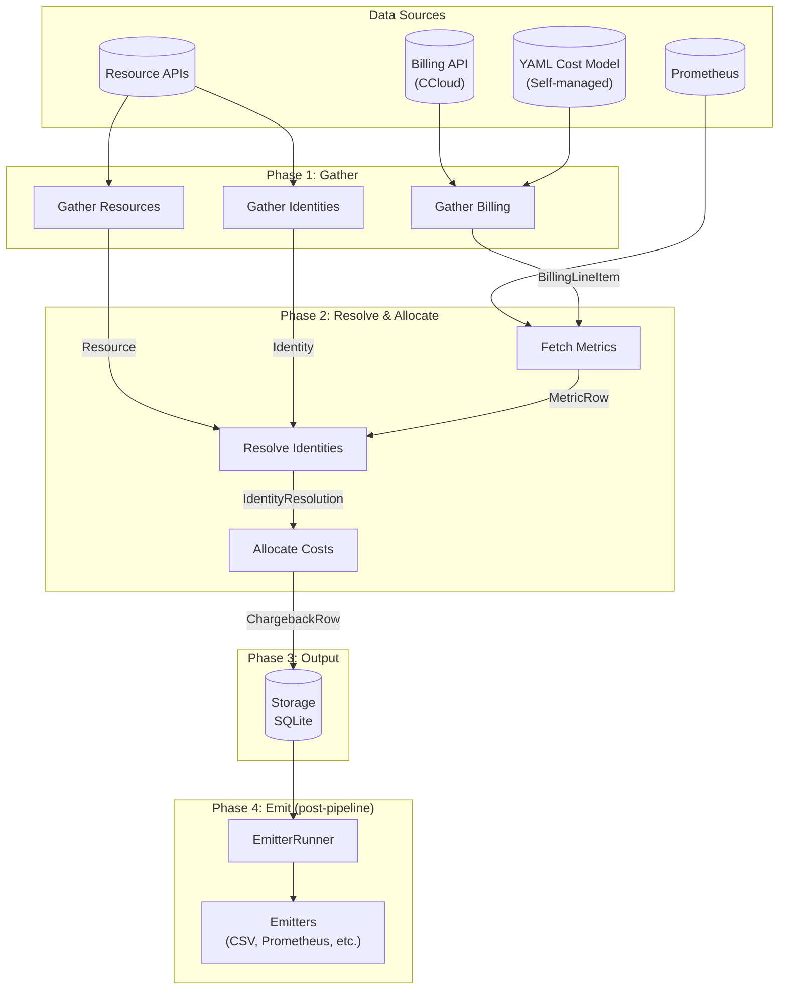
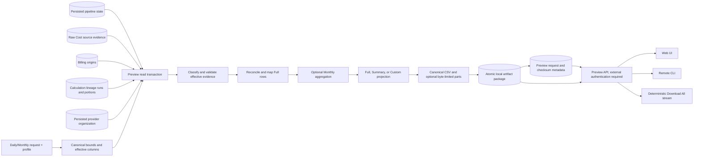

# Data Flow

## Pipeline overview

## Pipeline steps per date

1. **Gather billing** — `CostInput.gather(tenant_id, start, end, uow)`
   Returns `BillingLineItem` objects. CCloud fetches from billing API. Self-managed/generic
   constructs from YAML cost model + Prometheus.

2. **Gather resources** — `handler.gather_resources(tenant_id, uow)`
   discovers ordinary infrastructure resources. A separate plugin supplemental
   gather acquires the Confluent organization used as Preview billing-account
   authority. All are stored in `resources`.

3. **Gather identities** — `handler.gather_identities(tenant_id, uow)`
   Discovers principals, service accounts, teams.
   Stored in `identities` table.

4. **Detect deletions** — resource deletion authority is tracked per declared
   resource type. A type is scanned only when every handler declaring that type
   succeeded; IDs yielded under an undeclared type may be persisted but are
   never deletion authority. Identity deletion remains skipped after any
   handler failure. Supplemental organization reconciliation is isolated from
   both paths. Consecutive zero-gather thresholds prevent transient bulk
   deletion.

5. **Fetch metrics** — `metrics_source.query_range(...)` per handler
   Prometheus range queries for the billing period. Returns `MetricRow` objects.

6. **Resolve identities** — `handler.resolve_identities(tenant_id, resource_id, ...)`
   Maps billing line items to identities using metrics data.
   Returns `IdentityResolution` (list of `(identity_id, weight)` pairs).

7. **Allocate** — `allocator(AllocationContext) → AllocationResult`
   Splits cost across identities using configured strategy.
   UNALLOCATED identity used for unresolved costs.

8. **Commit** — `ChargebackRow` records written to storage.

The pipeline loop ends at step 8. Topic overlay (step 9) is a separate pass over completed dates.

9. **Topic overlay** *(CCloud only, optional)* — `TopicAttributionPhase.run(uow, date)`
   Runs after chargeback calculation. For each Kafka billing line item, queries
   Prometheus for per-topic byte metrics and splits the cluster cost across
   active topics. Results are written to `topic_attribution_facts`. Enabled via
   `plugin_settings.topic_attribution.enabled: true`. If Prometheus returns
   all-zero data, the `missing_metrics_behavior` setting controls the fallback
   (even-split or skip). If Prometheus is unreachable (infrastructure failure),
   the date stays pending and the pipeline retries on the next run. After
   `topic_attribution_retry_limit` consecutive failures for a cluster, sentinel
   rows are written (`topic_name=__UNATTRIBUTED__`, `attribution_method=ATTRIBUTION_FAILED`)
   preserving full cost, and the date is marked calculated.

10. **Emit (post-pipeline)** — `EmitterRunner` runs after each pipeline cycle completes.
   It queries storage for pending dates (not yet emitted, or previously failed, within
   each emitter's `lookback_days` window) and dispatches to each configured emitter.
   Outcome records (`emitted`, `failed`, `skipped`) are persisted per tenant/emitter/date,
   so already-emitted dates are not re-sent on the next cycle.

## Storage schema

| Table | Purpose |
|---|---|
| `billing` | Raw billing line items (composite PK: ecosystem, tenant_id, timestamp, resource_id, product_type, product_category) |
| `resources` | Discovered infrastructure resources with `created_at`, `deleted_at`, `last_seen_at` |
| `identities` | Discovered principals/service accounts with lifecycle timestamps |
| `chargeback_dimensions` | Unique (identity, resource, product, cost_type) combinations — the "what" |
| `chargeback_facts` | Cost amounts linked to dimensions via `dimension_id` — the "how much" |
| `pipeline_state` | Per-date progress flags plus the successful chargeback calculation ID, completion time, and optional owning-run provenance used by Preview |
| `topic_attribution_dimensions` | Unique (cluster, topic, product_type, attribution_method) combinations |
| `topic_attribution_facts` | Per-topic cost amounts linked to dimensions via `dimension_id` |
| `pipeline_runs` | Audit trail: run start/end, status, rows written, errors |
| `preview_requests` | Tenant-scoped Daily/Monthly scope, effective columns and evidence coverage, status/expiry/worker lease, diagnostics, source snapshot, and public artifact metadata (never server paths) |
| `custom_tags` | User-defined key/value tags attached to chargeback dimensions |
| `emission_records` | Per-tenant/emitter/date emission outcome tracking (emitted, failed) with attempt count |

Each row is scoped to `(ecosystem, tenant_id)`. No cross-tenant data access.

## Pipeline state tracking

The `pipeline_state` table enables resumption and prevents re-processing. The calculate
phase only processes dates where billing and resources are gathered but chargebacks not
yet calculated. When new billing data arrives for recent dates, the recalculation window
re-clears the `chargeback_calculated` flag so those dates get reprocessed.

The calculate phase writes `calculation_id`, `calculation_completed_at`, and
optional `calculation_run_id` in the same per-date transaction as the chargeback
rows. Preview uses the per-date identity and completion time as success authority;
the global `pipeline_runs` status is audit provenance and does not invalidate a
date that already committed.

## FOCUS Mapping Preview read path

Preview is read-only with respect to collected business data. It does not call a
provider, start a gather/calculation run, infer missing historical calculation
metadata, or expose an edit/backfill path. Migrated calculated dates without
usable correlation remain unchanged and produce a non-retryable metadata
diagnostic. Only the ordinary collector and calculation lifecycle can later
replace persisted data.

At submission, Preview canonicalizes either explicit Daily bounds or one
`YYYY-MM` Monthly interval, resolves Full/Summary/Custom effective columns, and
samples `created_at` once to derive an immutable policy
from tenant `focus_preview` configuration plus `lookback_days`/`cutoff_days`.
The worker first resolves the evidence interval. For Monthly, this classifies
future, provisional, or settlement-candidate state from immutable submission
time and the acquisition cutoff. A future month fails with the cutoff diagnostic
before calculation lookup. An empty provisional interval skips calculation
lookup and source/enrichment reads, but still checks Direct-billed PAYG and
configured-USD eligibility before producing a header-only package. For a
nonempty interval, Daily and Monthly both check calculation correlation and
complete coverage before commercial eligibility, then apply the complete
streamed structural/classification/financial source issue precedence.
Keyed TABLEFLOW provider-context rejection then precedes complete
source/aggregate coverage and the one-source-per-billing-origin cardinality
gate. Global aggregate currency and source equality checks precede complete
lineage run/portion structure; every origin is structurally valid before any
allocation cost/quantity total is reconciled. Billing-account,
resource/identity/environment, and separate tag enrichment follow. The mapping
path builds and validates complete Full rows before optional Monthly
aggregation. Monthly sums additive measures but retains allocation ratio/method,
target, classification, tier, pricing, tags, SKU, and provenance as grouping
dimensions. Full/Summary/Custom projection then selects output columns without
changing hidden row identity or reconciliation. Canonical row serialization
then produces one CSV by default or deterministic row-boundary parts when
`preview.max_csv_file_bytes` is configured. Data files are staged and fsynced
before one ready timestamp is chosen; the manifest and final directory are then
published atomically before the request is marked ready. Iterator order does
not change diagnostic precedence. All
nonempty evidence reads occur in one read-only transaction. Daily retains its
existing calculation-before-commercial diagnostic precedence.

Monthly requested bounds always cover the complete UTC calendar month. The
effective evidence end is frozen from request creation time and the acquisition
cutoff. A month is provisional until full-month evidence is available and the
72-hour post-month minimum has elapsed; a longer configured cutoff delays
settlement. Preview reads existing daily calculations and persisted allocation
lineage only: it does not call the provider, rerun allocation, or derive a
replacement allocation ratio.

The persisted `CCloudBillingLineItem` is the sole allocation origin. During the
ordinary calculation transaction, `CalculatePhase` stores lineage for the
actual output portions keyed back to that existing billing row. Raw Cost rows
remain source/classification/coverage evidence with a lossless association to
the billing key. The lineage path does not reconstruct billing from chargebacks,
redistribute costs, create a residual portion, or alter allocation policy.
Legacy raw-source rows without a billing association recover only through an
ordinary regather followed by ordinary calculation.

Older Daily/Full rows retain their original requested coverage and immutable
stored artifacts; new requests persist their exact effective columns and
evidence coverage.

Expected failures travel through the initialized diagnostic path and atomically
mark the request failed without a source snapshot or package. Source diagnostics
can persist up to 20 sorted, unique, opaque tenant-scoped correlations; raw
provider identities and payload fields never enter the public diagnostic.

Confluent's Costs API currently omits per-record ISO currency. Configured/default
USD establishes the eligible commercial contract, but it does not become source
evidence: mapped `BillingCurrency` remains null and the manifest records
`provider_billing_currency_field_unavailable`. No currency conversion occurs.
The maximum 364-day `lookback_days` is an acquisition/recalculation boundary,
not retention or a reconstruction promise.

Ready request metadata contains public manifest/file names, sizes, hashes, and
API URLs but never the storage key or filesystem path. The API verifies stored
bytes before serving the manifest or an individual file and builds Download All
as a bounded deterministic ZIP stream. Chitragupta provides no built-in REST
authentication; deployments must protect the entire Preview route prefix with
an authenticated reverse proxy or API gateway. UI and CLI clients consume
API-owned bytes and never run mapping or allocation logic.

Requested packages expire exactly seven days after ready publication. At the
cutoff, the database transition blocks all downloads before the artifact
directory is removed. Expired request and source-snapshot metadata remain
visible in recent history, while `package` becomes null. This fixed package
lifecycle is independent of tenant and topic-attribution retention.

All accepted native line types can consume persisted lineage. Multiple billing
origins and their actual identity/resource/`UNALLOCATED` portions are supported;
`UNALLOCATED` projects null allocated fields. Origin and target tags are loaded
separately at package time and become immutable stored bytes. Provider-null
promotional allowances and signed refunds preserve their native source and
financial semantics. TABLEFLOW provider context and multiple native/tier source
rows under one billing origin remain fail-closed. Complete semantic mapping is
not a conformance claim.

## Concurrency

Multiple tenants run concurrently (bounded by `features.max_parallel_tenants`).
One orchestrator per tenant. Thread-safe via per-tenant `TenantRuntime` isolation.
