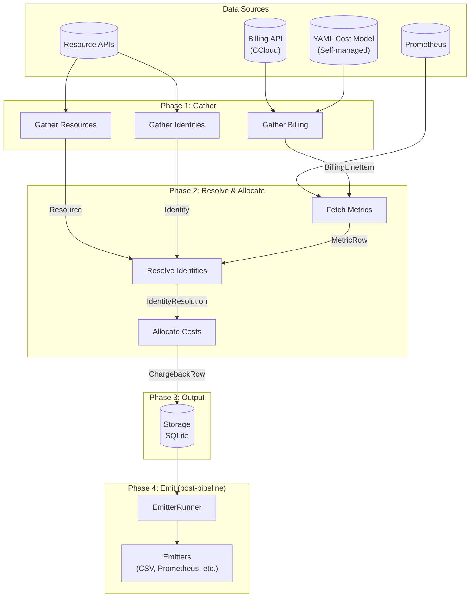

# Data Flow

## Pipeline overview

## Pipeline steps per date

1. **Gather billing** — `CostInput.gather(tenant_id, start, end, uow)`
   Returns `BillingLineItem` objects. CCloud fetches from billing API. Self-managed/generic
   constructs from YAML cost model + Prometheus.

2. **Gather resources** — `handler.gather_resources(tenant_id, uow)`
   Discovers infrastructure resources (clusters, topics, connectors, etc.).
   Stored in `resources` table.

3. **Gather identities** — `handler.gather_identities(tenant_id, uow)`
   Discovers principals, service accounts, teams.
   Stored in `identities` table.

4. **Detect deletions** — `_detect_entity_deletions()`
   Compares gathered entity IDs against previously active entities. Marks missing ones
   with `deleted_at` timestamp. Skipped if any handler gather failed. A consecutive
   zero-gather safety threshold prevents bulk deletion from transient API failures.

5. **Fetch metrics** — `metrics_source.query_range(...)` per handler
   Prometheus range queries for the billing period. Returns `MetricRow` objects.

6. **Resolve identities** — `handler.resolve_identities(tenant_id, resource_id, ...)`
   Maps billing line items to identities using metrics data.
   Returns `IdentityResolution` (list of `(identity_id, weight)` pairs).

7. **Allocate** — `allocator(AllocationContext) → AllocationResult`
   Splits cost across identities using configured strategy.
   UNALLOCATED identity used for unresolved costs.

8. **Commit** — `ChargebackRow` records written to storage.

The pipeline loop ends at step 8. Topic overlay (step 9) is a separate pass over completed dates.

9. **Topic overlay** *(CCloud only, optional)* — `TopicAttributionPhase.run(uow, date)`
   Runs after chargeback calculation. For each Kafka billing line item, queries
   Prometheus for per-topic byte metrics and splits the cluster cost across
   active topics. Results are written to `topic_attribution_facts`. Enabled via
   `plugin_settings.topic_attribution.enabled: true`. If Prometheus returns
   all-zero data, the `missing_metrics_behavior` setting controls the fallback
   (even-split or skip). If Prometheus is unreachable (infrastructure failure),
   the date stays pending and the pipeline retries on the next run. After
   `topic_attribution_retry_limit` consecutive failures for a cluster, sentinel
   rows are written (`topic_name=__UNATTRIBUTED__`, `attribution_method=ATTRIBUTION_FAILED`)
   preserving full cost, and the date is marked calculated.

10. **Emit (post-pipeline)** — `EmitterRunner` runs after each pipeline cycle completes.
   It queries storage for pending dates (not yet emitted, or previously failed, within
   each emitter's `lookback_days` window) and dispatches to each configured emitter.
   Outcome records (`emitted`, `failed`, `skipped`) are persisted per tenant/emitter/date,
   so already-emitted dates are not re-sent on the next cycle.

## Storage schema

| Table | Purpose |
|---|---|
| `billing` | Raw billing line items (composite PK: ecosystem, tenant_id, timestamp, resource_id, product_type, product_category) |
| `resources` | Discovered infrastructure resources with `created_at`, `deleted_at`, `last_seen_at` |
| `identities` | Discovered principals/service accounts with lifecycle timestamps |
| `chargeback_dimensions` | Unique (identity, resource, product, cost_type) combinations — the "what" |
| `chargeback_facts` | Cost amounts linked to dimensions via `dimension_id` — the "how much" |
| `pipeline_state` | Per-date progress flags: `billing_gathered`, `resources_gathered`, `chargeback_calculated`, `topic_overlay_gathered`, `topic_attribution_calculated` |
| `topic_attribution_dimensions` | Unique (cluster, topic, product_type, attribution_method) combinations |
| `topic_attribution_facts` | Per-topic cost amounts linked to dimensions via `dimension_id` |
| `pipeline_runs` | Audit trail: run start/end, status, rows written, errors |
| `custom_tags` | User-defined key/value tags attached to chargeback dimensions |
| `emission_records` | Per-tenant/emitter/date emission outcome tracking (emitted, failed) with attempt count |

Each row is scoped to `(ecosystem, tenant_id)`. No cross-tenant data access.

## Pipeline state tracking

The `pipeline_state` table enables resumption and prevents re-processing. The calculate
phase only processes dates where billing and resources are gathered but chargebacks not
yet calculated. When new billing data arrives for recent dates, the recalculation window
re-clears the `chargeback_calculated` flag so those dates get reprocessed.

## Concurrency

Multiple tenants run concurrently (bounded by `features.max_parallel_tenants`).
One orchestrator per tenant. Thread-safe via per-tenant `TenantRuntime` isolation.
