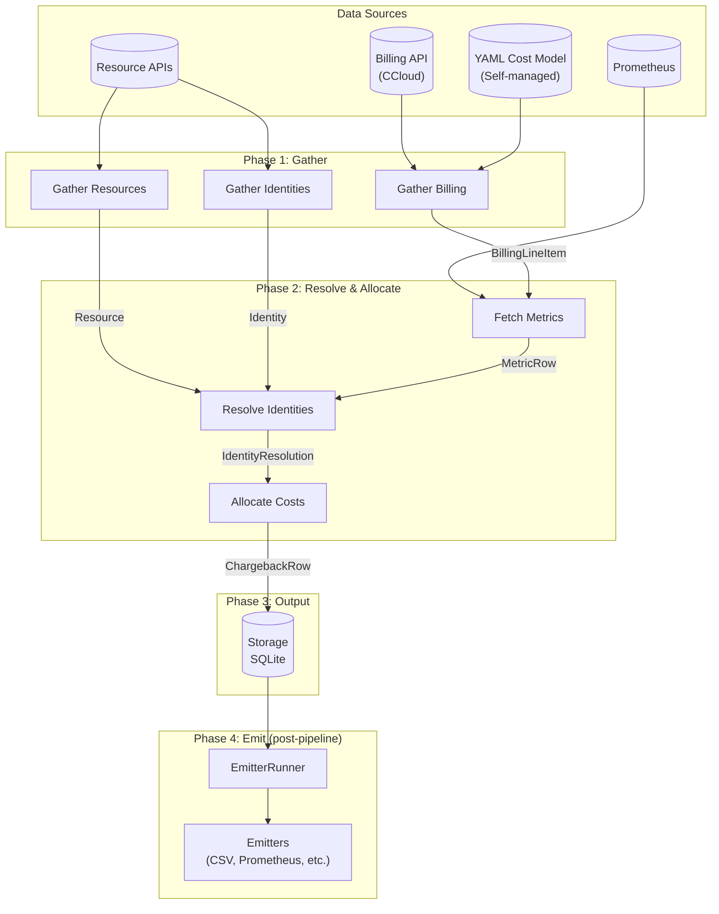
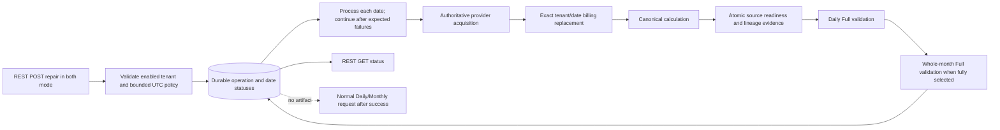
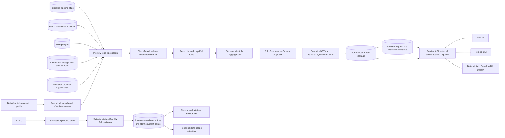

# Data Flow

## Pipeline overview


```mermaid
flowchart TD
    subgraph inputs["Data Sources"]
        BILLING[("Billing API<br/>(CCloud)")]
        YAML[("YAML Cost Model<br/>(Self-managed)")]
        PROM[("Prometheus")]
        API[("Resource APIs")]
    end

    subgraph gather["Phase 1: Gather"]
        G1["Gather Billing"]
        G2["Gather Resources"]
        G3["Gather Identities"]
    end

    subgraph resolve["Phase 2: Resolve & Allocate"]
        M["Fetch Metrics"]
        R["Resolve Identities"]
        A["Allocate Costs"]
    end

    subgraph output["Phase 3: Output"]
        DB[("Storage<br/>SQLite")]
    end

    subgraph emit["Phase 4: Emit (post-pipeline)"]
        ER["EmitterRunner"]
        E["Emitters<br/>(CSV, Prometheus, etc.)"]
    end

    BILLING --> G1
    YAML --> G1
    API --> G2
    API --> G3
    PROM --> M

    G1 --> |BillingLineItem| M
    G2 --> |Resource| R
    G3 --> |Identity| R
    M --> |MetricRow| R
    R --> |IdentityResolution| A
    A --> |ChargebackRow| DB
    DB --> ER
    ER --> E
```

## Pipeline steps per date

1. **Gather billing** — `CostInput.gather(tenant_id, start, end, uow)`
   returns `BillingLineItem` objects. CCloud fetches from the billing API.
   Self-managed/generic constructs from the YAML cost model and Prometheus.
   For a Preview-enabled Confluent tenant, the same provider pass also captures
   native source evidence; disabled tenants use the ordinary streaming path and
   create no Preview source evidence.

2. **Gather resources** — `handler.gather_resources(tenant_id, uow)`
   discovers ordinary infrastructure resources. For a Preview-enabled
   Confluent tenant, a separate isolated gather acquires the organization used
   as Preview billing-account authority. Disabled tenants do not call that
   endpoint.

3. **Gather identities** — `handler.gather_identities(tenant_id, uow)`
   Discovers principals, service accounts, teams.
   Stored in `identities` table.

4. **Detect deletions** — resource deletion authority is tracked per declared
   resource type. A type is scanned only when every handler declaring that type
   succeeded; IDs yielded under an undeclared type may be persisted but are
   never deletion authority. Identity deletion remains skipped after any
   handler failure. Supplemental organization reconciliation is isolated from
   both paths. Consecutive zero-gather thresholds prevent transient bulk
   deletion.

5. **Fetch metrics** — Prometheus range queries for the billing period return
   metric rows. Self-managed Kafka bounds each scope, cluster, and topic response to
   at most `H` closed UTC days (`H=5` when omitted, valid `1..30`) and reduces one
   workload chunk before requesting the next. Identical target-scope evidence is
   reused within a run by its exact tenant, selector, step, start, and end.

6. **Resolve identities** — `handler.resolve_identities(tenant_id, resource_id, ...)`
   Maps billing line items to identities using metrics data.
   Returns `IdentityResolution` (list of `(identity_id, weight)` pairs).

7. **Allocate** — `allocator(AllocationContext) → AllocationResult`
   Splits cost across identities using configured strategy.
   UNALLOCATED identity used for unresolved costs.

8. **Commit** — `ChargebackRow` records are written to storage. Enabled tenants
   also persist the allocation lineage needed by Preview; disabled tenants do
   not require lineage repositories or tables.

The pipeline loop ends at step 8. Topic overlay (step 9) is a separate pass over completed dates.

9. **Topic overlay** *(CCloud only, optional)* — `TopicAttributionPhase.run(uow, date)`
   Runs after chargeback calculation. For each Kafka billing line item, queries
   Prometheus for per-topic byte metrics and splits the cluster cost across
   active topics. Results are written to `topic_attribution_facts`. Enabled via
   `plugin_settings.topic_attribution.enabled: true`. If Prometheus returns
   all-zero data, the `missing_metrics_behavior` setting controls the fallback
   (even-split or skip). If Prometheus is unreachable (infrastructure failure),
   the date stays pending and the pipeline retries on the next run. After
   `topic_attribution_retry_limit` consecutive failures for a cluster, sentinel
   rows are written (`topic_name=__UNATTRIBUTED__`, `attribution_method=ATTRIBUTION_FAILED`)
   preserving full cost, and the date is marked calculated.

10. **Emit (post-pipeline)** — `EmitterRunner` runs after each pipeline cycle completes.
   It queries storage for pending dates (not yet emitted, or previously failed, within
   each emitter's `lookback_days` window) and dispatches to each configured emitter.
   Outcome records (`emitted`, `failed`, `skipped`) are persisted per tenant/emitter/date,
   so already-emitted dates are not re-sent on the next cycle.

### Self-managed bounded history and recovery

Self-managed Kafka validates target scope before workload, progress, or writes. An
open breaker issues one newest-point health probe; a failed probe performs no gather,
calculation, topic, or progress work. A successful probe is persisted as recovery
state, then the complete bounded scope is validated again before work resumes.
Calculation remains the owner of billing windows, so acquisition never widens or
invents a date set.

Counter evidence is evaluated at exact UTC day ends for the preceding half-open
`[day_start, day_end)` day. Gauge evidence keeps each daily start-anchored grid and
the same half-open filter, including non-divisor steps. Present zero remains distinct
from missing data; one failed family or day does not discard successful families or
later dates. Reduced chunk evidence is cleared after success, failure, or shutdown,
and existing residual, reconciliation, retry, and terminal-topic behavior is
preserved.

The optional self-managed topic overlay is a separate plugin-specific path. Confluent
Cloud keeps its existing configuration, query, progress, and topic behavior, and
generic metrics keeps its existing path; neither consumes the self-managed chunk
setting.

### Stable scope-gate capability contract (developer-facing)

`ScopeGatePlugin` remains the unchanged scope-gate contract. Two independent,
optional capabilities extend the self-managed lifecycle without changing that
existing shape:

- `ScopeGateRunLifecycle` resets run-local scope/evidence state. It affects progress
  ordering only when the plugin also implements the unchanged `ScopeGatePlugin`.
- `PostRecoveryGatherScopeValidator` performs the complete bounded gather-scope
  validation after recovery persistence and before downstream gather activity.

For an opted-in self-managed recovery, the stable order is:

```text
point probe
  → isolated recovery persistence
  → full bounded gather validation
  → authorized gathering progress
  → preview-source preparation
  → shared context
  → handlers and discovery
  → workload and writes
```

If full revalidation fails, the block is persisted in its own isolated unit of work
and none of the downstream calls in that sequence occur. For an opted-in throttled
gather, no gathering callback is emitted at all. A failed open probe is terminal for
all remaining gated stages in that run and is not repeated; calculation and
topic-overlay progress callbacks occur only after their complete applicable
preflights. If no stage callback is authorized, no final-clear callback is emitted.
Old-shape `ScopeGatePlugin` implementations retain their existing ordering and do
not receive either optional call. Confluent Cloud and generic metrics retain their
existing progress, query, and recovery ordering as well.

## Storage schema

| Table | Purpose |
|---|---|
| `billing` | Raw billing line items (composite PK: ecosystem, tenant_id, timestamp, resource_id, product_type, product_category) |
| `resources` | Discovered infrastructure resources with `created_at`, `deleted_at`, `last_seen_at` |
| `identities` | Discovered principals/service accounts with lifecycle timestamps |
| `chargeback_dimensions` | Unique (identity, resource, product, cost_type) combinations — the "what" |
| `chargeback_facts` | Cost amounts linked to dimensions via `dimension_id` — the "how much" |
| `pipeline_state` | Per-date progress flags plus the successful chargeback calculation ID, completion time, and optional owning-run provenance used by Preview |
| `topic_attribution_dimensions` | Unique (cluster, topic, product_type, attribution_method) combinations |
| `topic_attribution_facts` | Per-topic cost amounts linked to dimensions via `dimension_id` |
| `pipeline_runs` | Audit trail: run start/end, status, rows written, errors |
| `preview_requests` | Tenant-scoped Daily/Monthly scope, effective columns and evidence coverage, status/expiry/worker lease, diagnostics, source snapshot, and public artifact metadata (never server paths) |
| `ccloud_focus_preview_repairs` | Durable owner/range repair operation state and operation diagnostic for enabled Confluent Cloud tenants |
| `ccloud_focus_preview_repair_dates` | Ordered per-date repair status, calculation result, failure stage, and diagnostic |
| `custom_tags` | User-defined key/value tags attached to chargeback dimensions |
| `emission_records` | Per-tenant/emitter/date emission outcome tracking (emitted, failed) with attempt count |

Each row is scoped to `(ecosystem, tenant_id)`. No cross-tenant data access.

## Pipeline state tracking

The `pipeline_state` table enables resumption and prevents re-processing. The calculate
phase only processes dates where billing and resources are gathered but chargebacks not
yet calculated. When new billing data arrives for recent dates, the recalculation window
re-clears the `chargeback_calculated` flag so those dates get reprocessed.

The calculate phase writes `calculation_id`, `calculation_completed_at`, and
optional `calculation_run_id` in the same per-date transaction as the chargeback
rows. Preview uses the per-date identity and completion time as success authority;
the global `pipeline_runs` status is audit provenance and does not invalidate a
date that already committed.

## Historical FOCUS repair write path


```mermaid
flowchart LR
    POST[REST POST repair in both mode] --> POLICY[Validate enabled tenant and bounded UTC policy]
    POLICY --> STATUS[(Durable operation and date statuses)]
    STATUS --> DATE[Process each date; continue after expected failures]
    DATE --> PROVIDER[Authoritative provider acquisition]
    PROVIDER --> REPLACE[Exact tenant/date billing replacement]
    REPLACE --> CALC[Canonical calculation]
    CALC --> EVIDENCE[Atomic source readiness and lineage evidence]
    EVIDENCE --> DAILY[Daily Full validation]
    DAILY --> MONTH[Whole-month Full validation when fully selected]
    MONTH --> STATUS
    STATUS --> GET[REST GET status]
    STATUS -. no artifact .-> NORMAL[Normal Daily/Monthly request after success]
```

Repair is separate from package generation. It is REST-only, asynchronous, and
can be submitted only in `both` mode for a Preview-enabled Confluent Cloud
tenant. The half-open UTC range must fit the intersection of the configured
effective, lookback, cutoff, and complete retention intervals. Provider billing
credentials, retained Costs API history, and historical metrics needed by the
canonical allocators must remain available.

Each date's authoritative result replaces only its owner/date billing scope,
including an authoritative empty result. Canonical calculation then establishes
one consistent calculation identity, chargeback result, pipeline state, native
source evidence, and allocation lineage. Nothing is fabricated from legacy
aggregate rows. Expected date failures persist a stage and diagnostic and do not
stop later dates. Full-month dates remain `daily_validated` after Daily success
until Monthly validation atomically makes them terminal.

The target tenant is exclusively claimed for the operation; other tenants keep
running. Selected billing, chargebacks, and generic export results may change,
while dates and tenants outside the range are preserved. The repair path does
not run emitters, topic attribution, scheduled publication, retention, or
artifact persistence. It creates no requested package or revision. Startup
recovery marks interrupted unfinished work failed rather than resuming provider
calls; a retry is a new deterministic exact-date replacement operation.

## FOCUS Mapping Preview read path


```mermaid
flowchart LR
    REQ[Daily/Monthly request + profile] --> CAN[Canonical bounds and effective columns]
    PS[(Persisted pipeline state)] --> PR[Preview read transaction]
    SRC[(Raw Cost source evidence)] --> PR
    BILL[(Billing origins)] --> PR
    LINE[(Calculation lineage runs and portions)] --> PR
    ORG[(Persisted provider organization)] --> PR
    CAN --> PR
    PR --> READY[Classify and validate effective evidence]
    READY --> MAP[Reconcile and map Full rows]
    MAP --> MONTH[Optional Monthly aggregation]
    MONTH --> PROJ[Full, Summary, or Custom projection]
    PROJ --> PART[Canonical CSV and optional byte-limited parts]
    PART --> ART[(Atomic local artifact package)]
    ART --> META[(Preview request and checksum metadata)]
    META --> API[Preview API; external authentication required]
    ART --> API
    API --> UI[Web UI]
    API --> CLI[Remote CLI]
    API --> ZIP[Deterministic Download All stream]
    CALC --> SCHED[Successful periodic cycle]
    SCHED --> REV[Validate eligible Monthly Full revisions]
    REV --> HISTORY[(Immutable revision history and atomic current pointer)]
    HISTORY --> CAPI[Current and retained revision API]
    HISTORY --> RET[Periodic billing-scope retention]
```

Package generation is read-only with respect to collected business data. It
does not call a provider, start a gather/calculation run, or infer missing
historical calculation metadata. Migrated calculated dates without usable
correlation remain unchanged and produce a non-retryable metadata diagnostic
until the ordinary lifecycle or explicit repair establishes current
authoritative evidence.

This read path exists only for tenants with `focus_preview` enabled. Disabled
tenants do not initialize Preview artifacts/evidence or acquire organization,
source, or lineage authority. Mixed deployments keep these boundaries per
tenant. A Preview-specific acquisition, schema, or retention failure fails
Preview closed without changing an otherwise successful generic chargeback
result.

At submission, Preview canonicalizes either explicit Daily bounds or one
`YYYY-MM` Monthly interval, resolves Full/Summary/Custom effective columns, and
samples `created_at` once to derive an immutable policy
from tenant `focus_preview` configuration plus `lookback_days`/`cutoff_days`.
The worker first resolves the evidence interval. For Monthly, this classifies
future, provisional, or settlement-candidate state from immutable submission
time and the acquisition cutoff. A future month fails with the cutoff diagnostic
before calculation lookup. An empty provisional interval skips calculation
lookup and source/enrichment content reads, but still requires usable Preview
evidence storage, rejects a newer failed or pending source attempt, and checks
Direct-billed PAYG/configured-USD eligibility before producing a header-only
package. For a
nonempty interval, Daily and Monthly both check calculation correlation and
complete coverage before commercial eligibility, then apply the complete
streamed structural/classification/financial source issue precedence.
Keyed TABLEFLOW provider-context rejection then precedes complete
source/aggregate coverage and the one-source-per-billing-origin cardinality
gate. Global aggregate currency and source equality checks precede complete
lineage run/portion structure; every origin is structurally valid before any
allocation cost/quantity total is reconciled. Billing-account,
resource/identity/environment, and separate tag enrichment follow. The mapping
path builds and validates complete Full rows before optional Monthly
aggregation. Monthly sums additive measures but retains allocation ratio/method,
target, classification, tier, pricing, tags, SKU, and provenance as grouping
dimensions. Full/Summary/Custom projection then selects output columns without
changing hidden row identity or reconciliation. Canonical row serialization
then produces one CSV by default or deterministic row-boundary parts when
`preview.max_csv_file_bytes` is configured. Data files are staged and fsynced
before one ready timestamp is chosen; the manifest and final directory are then
published atomically before the request is marked ready. Iterator order does
not change diagnostic precedence. All
nonempty evidence reads occur in one read-only transaction. Daily retains its
existing calculation-before-commercial diagnostic precedence.

Monthly requested bounds always cover the complete UTC calendar month. The
effective evidence end is frozen from request creation time and the acquisition
cutoff. A month is provisional until full-month evidence is available and the
72-hour post-month minimum has elapsed; a longer configured cutoff delays
settlement. Preview reads existing daily calculations and persisted allocation
lineage only: it does not call the provider, rerun allocation, or derive a
replacement allocation ratio.

The persisted `CCloudBillingLineItem` is the sole allocation origin. During the
ordinary calculation transaction, `CalculatePhase` stores lineage for the
actual output portions keyed back to that existing billing row. Raw Cost rows
remain source/classification/coverage evidence with a lossless association to
the billing key. The lineage path does not reconstruct billing from chargebacks,
redistribute costs, create a residual portion, or alter allocation policy.
Valid legacy raw-source rows without a billing association can receive local
authority from their retained values when an enabled tenant starts; this does
not call the provider or alter financial values. Unreadable, ambiguous, or
inconsistent legacy evidence remains fail-closed. A later ordinary
regather/calculation or explicit retained-date repair can establish new current
evidence.

Older Daily/Full rows retain their original requested coverage and immutable
stored artifacts; new requests persist their exact effective columns and
evidence coverage.

After a successful periodic pipeline cycle, the worker separately evaluates
eligible calendar months for scheduled publication. Before constructing a
request or projecting a package, it excludes active months, months less than
72 hours past their end, and months whose configured acquisition cutoff does not
cover the complete month. Settlement-ready months use the same persisted
calculation, source, allocation-lineage, enrichment, mapping, and reconciliation
path as Monthly Full generation. The initial pass publishes only validated
Settled revisions, including a settlement-ready valid header-only month. Later
publication is driven by changed logical projected content or mapping semantics
and produces another Settled replacement. Physical CSV partitioning alone is not
material.

Data files and the revision manifest become immutable before the database
current pointer changes. Replacing a revision and linking its superseded
revision are one transaction. Any generation, validation, artifact, persistence,
or concurrent-publication failure leaves the prior current revision unchanged.
The read path exposes one current revision per configured storage owner and UTC
month plus newest-first retained history. Current manifest, file, and archive
URLs carry a revision guard so a replacement between metadata discovery and
download returns a retryable conflict instead of serving mixed revisions.
Direct retained-revision URLs are immutable and expose the same validated
manifest, files, and archive. History metadata records whether a revision is
current or superseded, its predecessor/successor relationship, source freshness,
and its validation summary. Revisions are complete replacements and are never
intended to be aggregated.

Expected failures travel through the initialized diagnostic path and atomically
mark the request failed without a source snapshot or package. Source diagnostics
can persist up to 20 sorted, unique, opaque tenant-scoped correlations; raw
provider identities and payload fields never enter the public diagnostic.

Confluent's Costs API currently omits per-record ISO currency. Configured/default
USD establishes the eligible commercial contract and is copied into mapped
`BillingCurrency` as billing-scope authority, not provider-record evidence.
Non-USD remains fail-closed, and no currency conversion occurs.
The maximum 364-day `lookback_days` is an acquisition/recalculation boundary,
not retention or a reconstruction promise.

Ready request metadata contains public manifest/file names, sizes, hashes, and
API URLs but never the storage key or filesystem path. The API verifies stored
bytes before serving the manifest or an individual file and builds Download All
as a bounded deterministic ZIP stream. Chitragupta provides no built-in REST
authentication; deployments must protect the entire Preview route prefix with
an authenticated reverse proxy or API gateway. UI and CLI clients consume
API-owned bytes and never run mapping or allocation logic.

Requested packages expire exactly seven days after ready publication. At the
cutoff, the database transition blocks all downloads before the artifact
directory is removed. Expired request and source-snapshot metadata remain
visible in recent history, while `package` becomes null. This fixed package
lifecycle is independent of tenant and topic-attribution retention.

Published revision retention follows the tenant billing-data `retention_days`
calendar cutoff instead. Periodic cleanup first hides every revision for an
out-of-policy month, then removes its immutable package and finally its metadata.
Failed package removal remains pending and is retried on later periodic cycles,
including after restart. Current revisions are protected only while their month
remains inside the retention window. Ad-hoc requested packages continue to use
their separate fixed seven-day lifecycle.

All accepted native line types can consume persisted lineage. Multiple billing
origins and their actual identity/resource/`UNALLOCATED` portions are supported;
`UNALLOCATED` projects null allocated fields. Origin and target tags are loaded
separately at package time and become immutable stored bytes. Provider-null
promotional allowances and signed refunds preserve their native source and
financial semantics. TABLEFLOW provider context and multiple native/tier source
rows under one billing origin remain fail-closed. Complete semantic mapping is
not a conformance claim.

## Concurrency

Multiple tenants run concurrently (bounded by `features.max_parallel_tenants`).
One orchestrator runs per tenant. Ordinary pipeline, repair, publication, and
retention work serialize for the same tenant; repair does not introduce a
global lock, so other tenants continue through per-tenant `TenantRuntime`
isolation.
