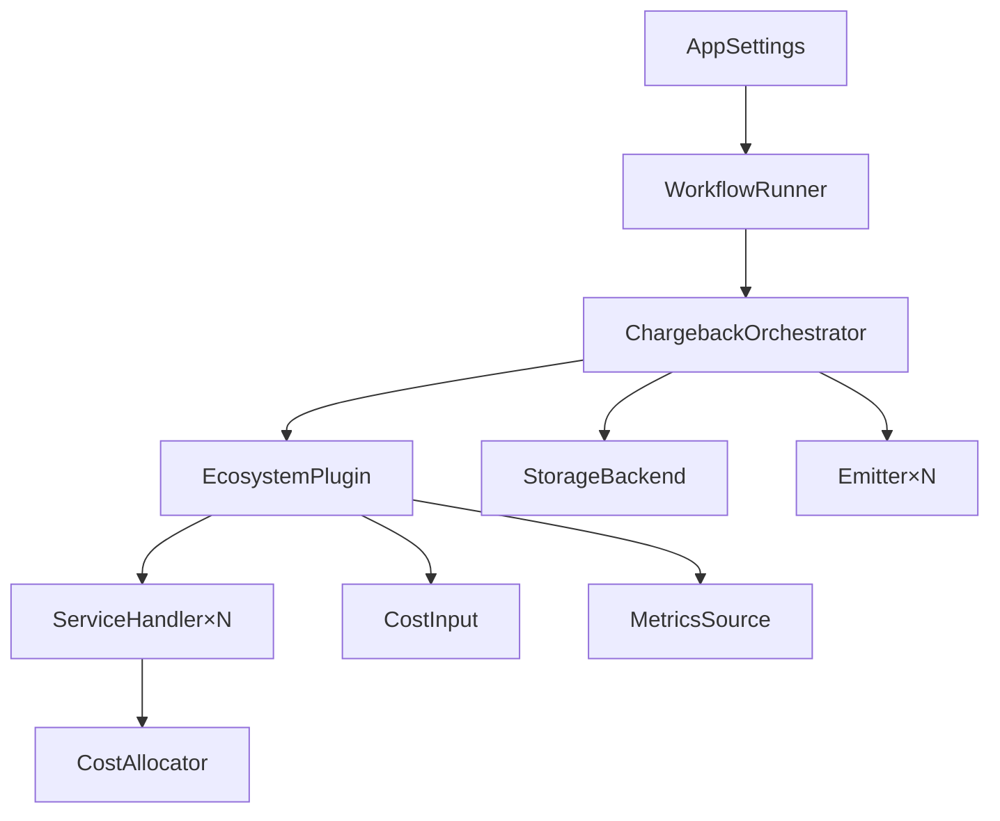

# Architecture Overview

The engine is a multi-tenant cost allocation pipeline. Each tenant maps to one ecosystem plugin.

## Component hierarchy

## Layers

| Layer | Package | Responsibility |
|---|---|---|
| Entry point | `src/main.py` | Arg parsing, mode selection, signal handling |
| Runner | `src/workflow_runner.py` | Periodic execution, tenant lifecycle, concurrency |
| Orchestrator | `src/core/engine/orchestrator.py` | Pipeline steps per tenant per date |
| Plugin | `src/plugins/*/plugin.py` | Ecosystem-specific initialization and wiring |
| Handler | `src/plugins/*/handlers/` | Resource/identity gather and cost allocation |
| Storage | `src/core/storage/` | SQLModel + Alembic, per-tenant isolation |
| API | `src/core/api/` | FastAPI REST, reads from storage |
| Emitters | `src/emitters/` | Output sinks (CSV, etc.) |

## Detailed documentation

| Page | Purpose |
|---|---|
| [Plugin System](plugin-system.md) | Protocol hierarchy and plugin loading |
| [Data Flow](data-flow.md) | Step-by-step pipeline execution |
| [Identity Resolution](identity-resolution.md) | How principals map to cost allocations |
