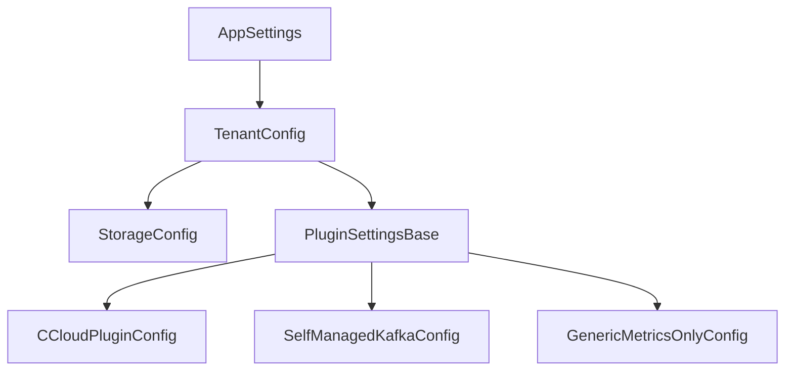

# Configuration Reference

This section provides complete configuration documentation for each supported ecosystem.

## Model hierarchy



## Choose your ecosystem

| Ecosystem | Plugin key | Use case |
|---|---|---|
| [Confluent Cloud](ccloud-reference.md) | `confluent_cloud` | CCloud organizations with billing API access |
| [Self-Managed Kafka](self-managed-reference.md) | `self_managed_kafka` | On-prem or cloud-hosted Kafka with Prometheus JMX metrics |
| [Generic Metrics](generic-metrics-reference.md) | `generic_metrics_only` | Any Prometheus-instrumented system with custom cost model |

## Common fields

All tenants share these `TenantConfig` fields:

| Field | Type | Default | Description |
|---|---|---|---|
| `ecosystem` | string | required | Plugin key from the table above |
| `tenant_id` | string | required | Unique identifier for this tenant |
| `lookback_days` | int | 200 | Days of billing history to fetch |
| `cutoff_days` | int | 5 | Skip dates within this many days of today |
| `retention_days` | int | 250 | Delete data older than this |
| `storage.connection_string` | string | required | Database URL (SQLite or PostgreSQL) |

## Emitters

Emitters receive the final chargeback rows after each billing date is calculated and write them to one or more destinations. Each tenant can configure multiple emitters under `plugin_settings.emitters`.

### CSV emitter

Writes one CSV file per billing date into a local directory.

```yaml
emitters:
  - type: csv
    aggregation: daily        # optional — coarsen before writing
    params:
      output_dir: /app/output/chargebacks
```

### Prometheus emitter

Exposes chargeback and supporting data as Prometheus/OpenMetrics gauge metrics on an HTTP server. Useful for scraping with Prometheus or backfilling a TSDB using the bundled collector script.

```yaml
emitters:
  - type: prometheus
    aggregation: daily
    params:
      port: 9090              # port for the /metrics HTTP endpoint (default: 8000)
```

**Metric families exposed:**

| Metric | Labels | Description |
|---|---|---|
| `chitragupt_chargeback_amount` | `tenant_id`, `ecosystem`, `identity_id`, `resource_id`, `product_type`, `cost_type`, `allocation_method` | Cost allocated to each identity |
| `chitragupt_billing_amount` | `tenant_id`, `ecosystem`, `resource_id`, `product_type`, `product_category` | Raw billing cost per resource |
| `chitragupt_resource_active` | `tenant_id`, `ecosystem`, `resource_id`, `resource_type` | Active resources at billing date (value always 1) |
| `chitragupt_identity_active` | `tenant_id`, `ecosystem`, `identity_id`, `identity_type` | Active identities at billing date (value always 1) |

All samples carry the billing date as a Unix timestamp (midnight UTC), not the wall-clock time of emission. This makes them suitable for TSDB backfill.

**Server lifecycle:** The HTTP server starts once per process on the configured port. When multiple tenants share a process, they share the server — configure the same port for all tenants or use only one tenant per process.

See [`deployables/assets/prometheus_for_chargeback/collector.sh`](../deployables/assets/prometheus_for_chargeback/collector.sh) and [Deployment](../operations/deployment.md#prometheus-collector-script) for TSDB backfill instructions.

## Advanced configuration

See [Advanced Scenarios](advanced-scenarios.md) for multi-tenant setups, custom granularity, and allocator overrides.
