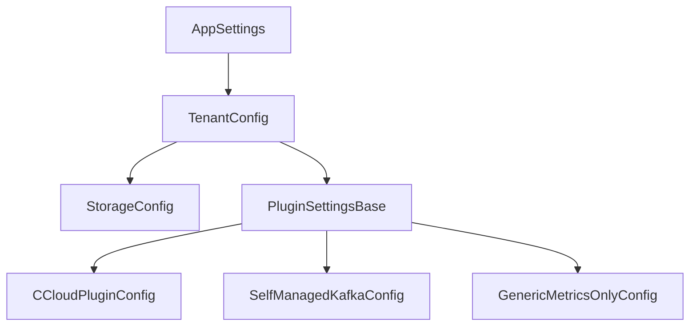

# Configuration Reference

This section provides complete configuration documentation for each supported ecosystem.

## Model hierarchy

## Choose your ecosystem

| Ecosystem | Plugin key | Use case |
|---|---|---|
| [Confluent Cloud](ccloud-reference.md) | `confluent_cloud` | CCloud organizations with billing API access |
| [Self-Managed Kafka](self-managed-reference.md) | `self_managed_kafka` | On-prem or cloud-hosted Kafka with Prometheus JMX metrics |
| [Generic Metrics](generic-metrics-reference.md) | `generic_metrics_only` | Any Prometheus-instrumented system with custom cost model |

## Common fields

All tenants share these `TenantConfig` fields:

| Field | Type | Default | Description |
|---|---|---|---|
| `ecosystem` | string | required | Plugin key from the table above |
| `tenant_id` | string | required | Unique identifier for this tenant |
| `lookback_days` | int | 200 | Days of billing history to fetch |
| `cutoff_days` | int | 5 | Skip dates within this many days of today |
| `retention_days` | int | 250 | Delete data older than this |
| `storage.connection_string` | string | required | Database URL (SQLite or PostgreSQL) |

## Advanced configuration

See [Advanced Scenarios](advanced-scenarios.md) for multi-tenant setups, custom granularity, and allocator overrides.
