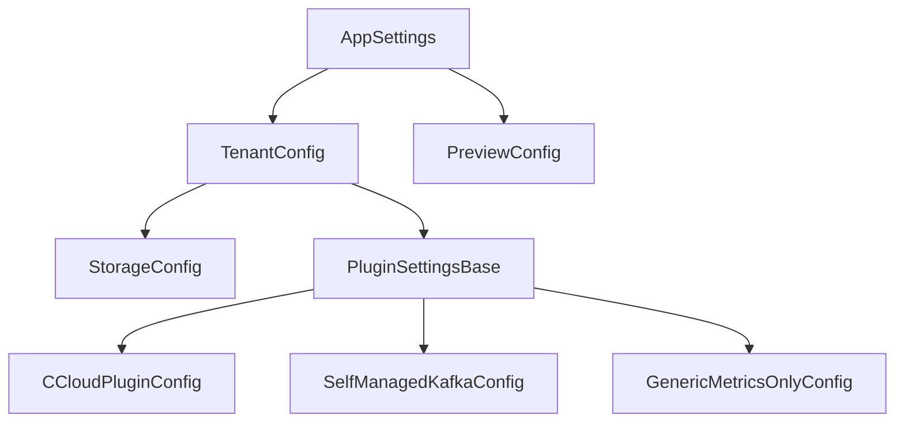

# Configuration Reference

This section provides complete configuration documentation for each supported ecosystem.

!!! tip "Start with the guide"
    If you're building a configuration from scratch, start with the
    [Configuration Guide](guide.md). It walks through the decisions you need to make
    and explains the tradeoffs. The reference pages below cover every field, but
    the guide explains *when and why* to use them.

## Model hierarchy



## Choose your ecosystem

| Ecosystem | Plugin key | Use case |
|---|---|---|
| [Confluent Cloud](ccloud-reference.md) | `confluent_cloud` | CCloud organizations with billing API access |
| [Self-Managed Kafka](self-managed-reference.md) | `self_managed_kafka` | On-prem or cloud-hosted Kafka with Prometheus JMX metrics |
| [Generic Metrics](generic-metrics-reference.md) | `generic_metrics_only` | Any Prometheus-instrumented system with custom cost model |

## Common fields

All tenants share these `TenantConfig` fields:

| Field | Type | Default | Description |
|---|---|---|---|
| `ecosystem` | string | required | Plugin key from the table above |
| `tenant_id` | string | required | Unique partition key for DB records. Can be any string (e.g. `prod`, `acme-corp`). This is **not** a vendor-specific ID (e.g. not your CCloud Organization ID) — it is an internal label used to isolate data across tenants in the database. |
| `lookback_days` | int | 200 | Provider acquisition/recalculation window in days (1–364 and greater than `cutoff_days`); not retention or guaranteed reconstructability |
| `cutoff_days` | int | 5 | Skip dates within this many days of today |
| `retention_days` | int | 250 | Delete data older than this |
| `storage.connection_string` | string | required | Database URL (SQLite or PostgreSQL) |

## FOCUS Mapping Preview

Preview artifact storage, worker concurrency, and CSV part sizing are
process-wide settings, not tenant settings:

```yaml
preview:
  artifact_root: /var/lib/chitragupta/focus-preview
  max_workers: 2
  max_csv_file_bytes: null
```

| Field | Type | Default | Constraints | Description |
|---|---|---|---|---|
| `preview.artifact_root` | path | `data/focus-preview` | writable directory | Durable local root for immutable Preview packages. Relative paths resolve from the process working directory. |
| `preview.max_workers` | int | `2` | 1–16 | Maximum Preview generation jobs in this API process. |
| `preview.max_csv_file_bytes` | int or null | `null` | positive integer or null | Maximum bytes per CSV part, including its repeated header and LF record terminators. `null` emits one `cost-and-usage.csv`; a positive value enables deterministic row-boundary partitioning. |

The artifact root must be on durable storage and writable by the API process.
For containers, mount it into the data volume. The database stores request and
artifact metadata; artifact bytes remain under this root and are served through
the Preview API. The REST API has no built-in authentication. Put the complete
Preview route prefix, including request history, status, manifest, file, and
archive routes, behind an authenticated reverse proxy or API gateway. Changing
the root does not move existing packages.

Confluent Cloud tenants can optionally declare the commercial contract required
for Preview:

```yaml
tenants:
  production:
    focus_preview:
      commercial_profile: direct_payg
      billing_currency: USD       # optional; defaults to normalized USD
      effective_start_date: 2026-01-01
      effective_end_date: 2027-01-01
```

| Field | Type | Default | Constraints | Description |
|---|---|---|---|---|
| `focus_preview` | mapping | absent | Confluent Cloud only | Optional block. Absence remains valid application configuration but every Preview request fails closed. |
| `focus_preview.commercial_profile` | string | required in block | `direct_payg` | Declares the supported Direct-billed PAYG arrangement. |
| `focus_preview.billing_currency` | string | `USD` | three ASCII letters | Normalized uppercase. Non-USD loads but Preview fails without conversion. |
| `focus_preview.effective_start_date` | date | required in block | before end | Inclusive start of the commercial declaration. |
| `focus_preview.effective_end_date` | date | required in block | after start | Exclusive end; the complete request must be contained in the interval. |

Confluent's Costs API does not supply a per-record ISO currency value. USD is the
current configured contract, while generated `BillingCurrency` remains null and
the manifest identifies the provider-field limitation. See the
[Confluent Cloud reference](ccloud-reference.md#focus-mapping-preview-eligibility)
for the fail-closed rules and retention boundary.

See [FOCUS Mapping Preview](../focus-mapping-preview.md) for the complete setup,
request, download, package, expiry, and customization workflow.

## Emitters

Emitters receive the final chargeback rows after each billing date is calculated and write them to one or more destinations. Each tenant can configure multiple emitters under `plugin_settings.emitters`.

### CSV emitter

Writes one CSV file per billing date into a local directory.

```yaml
emitters:
  - type: csv
    aggregation: daily        # optional — coarsen before writing
    params:
      output_dir: /app/output/chargebacks
```

### Prometheus emitter

Exposes chargeback and supporting data as Prometheus/OpenMetrics gauge metrics on an HTTP server. Useful for scraping with Prometheus or backfilling a TSDB using the bundled collector script.

```yaml
emitters:
  - type: prometheus
    aggregation: daily
    params:
      port: 9090              # port for the /metrics HTTP endpoint (default: 8000)
```

**Metric families exposed:**

| Metric | Labels | Description |
|---|---|---|
| `chitragupta_chargeback_amount` | `tenant_id`, `ecosystem`, `identity_id`, `resource_id`, `product_type`, `cost_type`, `allocation_method` | Cost allocated to each identity |
| `chitragupta_billing_amount` | `tenant_id`, `ecosystem`, `resource_id`, `product_type`, `product_category` | Raw billing cost per resource |
| `chitragupta_resource_active` | `tenant_id`, `ecosystem`, `resource_id`, `resource_type` | Active resources at billing date (value always 1) |
| `chitragupta_identity_active` | `tenant_id`, `ecosystem`, `identity_id`, `identity_type` | Active identities at billing date (value always 1) |

All samples carry the billing date as a Unix timestamp (midnight UTC), not the wall-clock time of emission. This makes them suitable for TSDB backfill.

**Server lifecycle:** The HTTP server starts once per process on the configured port. When multiple tenants share a process, they share the server — configure the same port for all tenants or use only one tenant per process.

See [`examples/shared/scripts/collector.sh`](https://github.com/waliaabhishek/chitragupta/blob/main/examples/shared/scripts/collector.sh) and [Deployment](../operations/deployment.md#prometheus-collector-script) for TSDB backfill instructions.

## Advanced configuration

See [Advanced Scenarios](advanced-scenarios.md) for multi-tenant setups, custom granularity, and allocator overrides.
